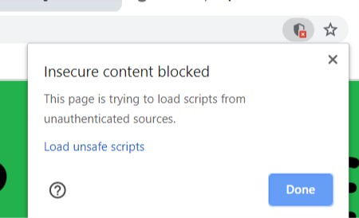
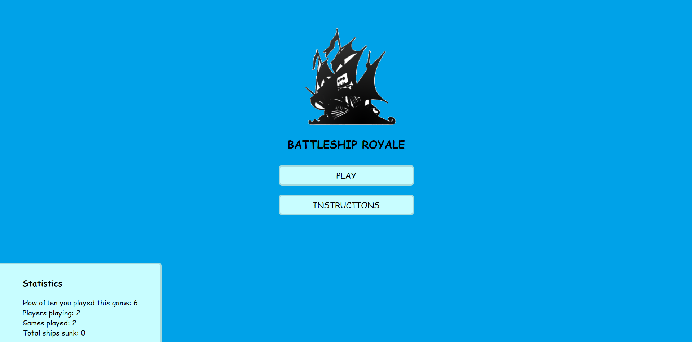
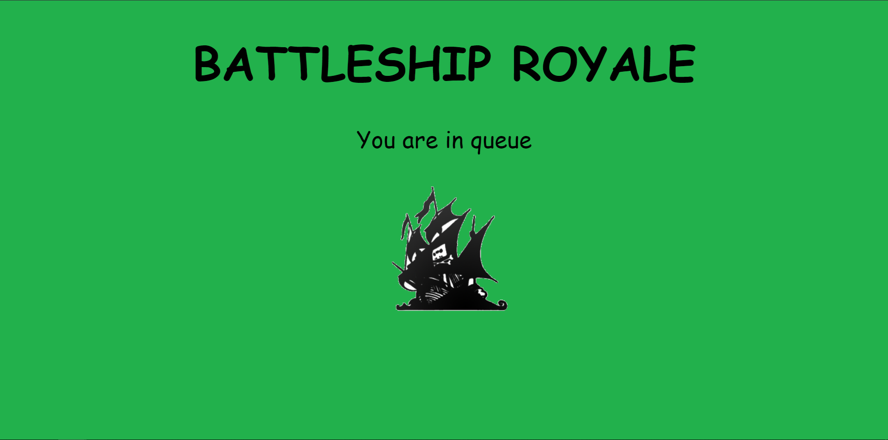
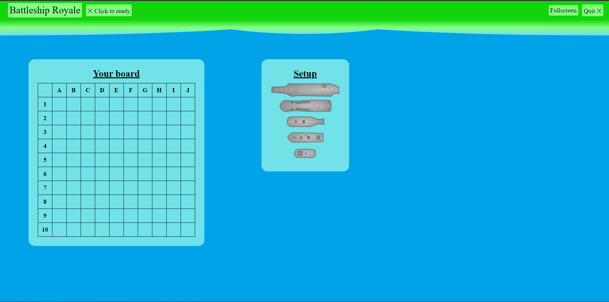
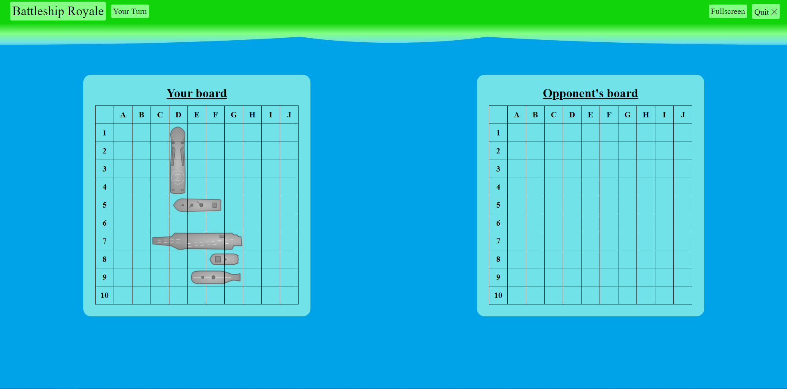

# About the project
A web-browser game inspired by the famous Battleship board game. 
Implemented from scratch, this is my first coding project.

## Tools used for the project 
Technologies: HTML, CSS, JavaScript, Node.js, Express.js, Git, Github

## Running the application
Game has been deployed to Microsoft Azure visible and playable for everyone.

Just click on play and you will be immediately queued against an other player. In case there is no one in queue
but you would still like to try out the game, just open another tab and launch the game,
thus you will be queued against yourself.

Make sure to enable loading on unsafe scripts in your browser in order to be launched into the setup phase.

https://battleshiproyale.azurewebsites.net/

## App Tour
#### Landing Page

The instructions button simply opens a modal window and informs the user regarding the rules of the game.

#### Loading Page   

### Setup Phase
 

During the setup phase the user is able to allocate the boats to their desired location or 
press the click to ready button to have the boats randomly placed on the board.

### Game Phase
